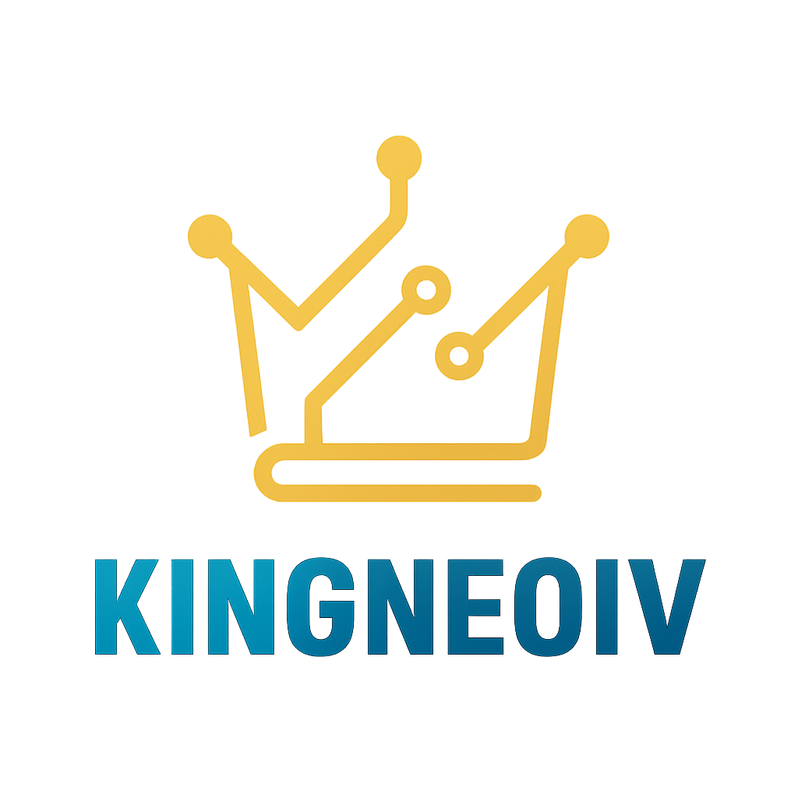

 
  

## Hi there 👋

I'm a indie full‑stack developer building modern, cross‑platform applications using <b>FastAPI</b>, <b>React</b>, <b>PostgreSQL</b>, and <b>Docker</b> — while still maintaining my roots in <b>Python</b>, <b>C++</b>, and <b>desktop application development</b>.

I design systems that run on <b>Windows</b>, <b>macOS</b>, <b>Linux</b>, <b>iOS</b>, and <b>Android</b>, with a focus on clean architecture, modular design, and production‑ready engineering.

 

---

<!-- ===================== -->
<!--     TECH STACK        -->
<!-- ===================== -->

---

<!-- ===================== -->
<!--   OPERATING SYSTEMS   -->
<!-- ===================== -->

---

<!-- ===================== -->
<!--   LOCATION & SOCIAL   -->
<!-- ===================== -->

 

---

## 🚀 Current Project

### [u-sell-it](https://github.com/KingNeoIV/u-sell-it)

A modern, cross‑platform marketplace ecosystem built with:

- ⚡ **FastAPI backend** (JWT auth, SQLAlchemy 2.0, PostgreSQL)
- 🎨 **React + TypeScript frontend** (coming soon)
- 🐘 **PostgreSQL database** (Dockerized)
- 📱 **Future iOS + Android clients**
- 🖥️ **Future macOS + Windows desktop clients**
- 🧩 **Legacy PyQt6 + C++ desktop prototype preserved**

🔨 **Status:** Backend architecture in progress (auth, models, services).  
📅 **Roadmap:** Backend → Frontend → Mobile → Desktop → Deployment.

  
  
  

